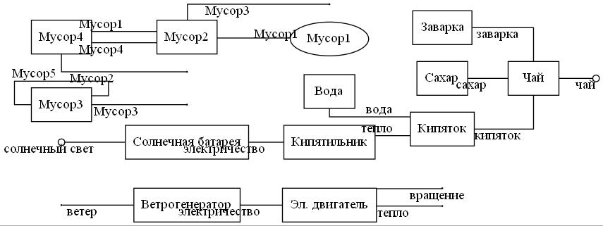
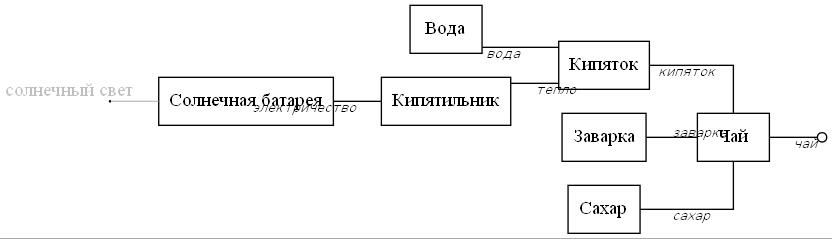
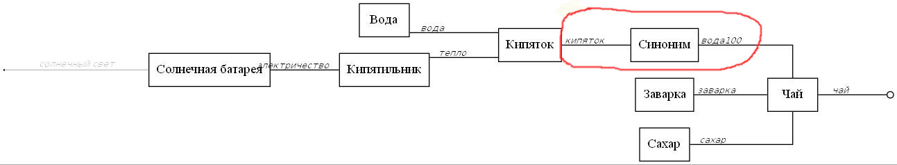
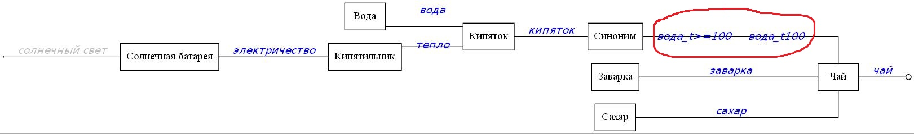

# Проект «Сшивка»

Данным интеллектуальным алгоритмом можно *автоматически* формировать схемы бизнес-процессов (BPMN), технологические карты, электрические схемы, UML диаграммы.

### Принцип действия

Генетический алгоритм согласно целевой функции формирует оптимальную схему процесса из функциональных блоков (базы данных), заданных в текстовых файлах, начинающимся с "db": [db.txt](db.txt), db2.txt, [db_target.txt](db_target.txt) итд. 

### Формат файла

*Имя функции 
-входная переменная 1, 2, 3 
-выходная переменная 1, 2, 3 
-цена (если нет строки = 0)*

Функции разделены минимум одной строкой. 
Обязательная функция:

*Target 
-Конечные цели 
-Имеющиеся ресурсы*

Функции задаются согласно концепции «Семантический ТРИЗ», т.е. входные и выходные параметры – [веполи](https://dic.academic.ru/dic.nsf/ruwiki/837716 "веполи").

### Запуск
**java – jar knitter_demo.jar**

После работы программы получаем схему в формате [Dot](https://graphviz.org/download/ "graphviz.org"), которая преобразуется в картинку в формате JPG. Если не сработало (jar сделан для Windows), то запустите следующую команду: 

**dot schem.dot -Tjpg -o schem.jpg**

### Пример
 

Было  &uarr; 
Стало &darr; 

------------
 

В текстовых файлах, начинающимся с "synonym": [synonyms.txt](synonyms.txt), synonym2.txt итд. добавляются синонимы для формирования функций-преобразователей. В каждой строчке по два через точку с запятой (;).
Результат: 

**Решетка (#), поставленная в начале строки текстовых файлов, "выключает" строку. Если поставить ее в названии функции, то парсер проигнорирует всю функцию. В других строках-параметрах лучше пользоваться этим 'без фанатизма'**

### Сшивка по диапазонам параметров 
При указании диапазов надо указывать латинские буквы, обозначающие физическую величину (t - температура, v - объем, m - масса итп). 
Пример: вода_t20, вода_t20-30, вода_t>=100, вода_v<1.5. 
Имеется возможно указывать отрицательные значения чисел и менять положения физ. величины (измерения): напряжение_11.5-14.4вольт, воздух_-20--5градусов. 
Сравнение происходит по нескольким измерениям по принципу "все или ничего": "напряжение_220вольт_5-10ампер" == "напряжение_12-300вольт_7ампер", "напряжение_220вольт_5-10ампер" == "напряжение_12-300вольт_>=7ампер", "напряжение_12вольт_5ампер" <> "напряжение_12вольт", "напряжение_220вольт_5-10ампер" <> "напряжение_220вольт_20ампер".

### 'Заморозка' схемы
Из файла "schem.lst" (или из того, что задается в командной строке параметром --load_schem_lst) загружается список соединений. 
Список состоит из строк вида [ИзФункции][Парам2][ВФункцию][Парам2]. 
Сама программа генерирует строки [ИзФункции].[Парам2] - [ВФункцию].[Парам2]. Для наглядности. Если указан параметр --save_schem_lst. 
Если какие-то функции можно/нужно оптимизировать, то их соединения надо удалить из списка. 
[Подробнее тут](https://dzen.ru/media/maxzawalo/sshivka-zamorojennyi-genom-65829cfc910b21212106979a)

### Экспорт и импорт схемы в формат drawio
[Подробнее тут](https://dzen.ru/media/maxzawalo/sshivka-shema-v-formate-drawio-65849bcfaa8dfa366da410a4)

### Генераторы функций
[Подробнее тут](https://dzen.ru/media/maxzawalo/sshivka-generatory-funkcii-6591bb5dba630d0653dd05cf)

### [Поддержать проект](https://yoomoney.ru/to/410011136228964)