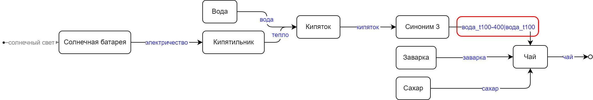

# Проект «Сшивка»

Данным интеллектуальным алгоритмом можно *автоматически* формировать схемы бизнес-процессов (BPMN), технологические карты, электрические схемы, UML диаграммы.

### Принцип действия

Генетический алгоритм согласно целевой функции формирует оптимальную схему процесса из функциональных блоков (базы данных), заданных в файле [in_schem.txt](in_schem.txt "in_schem.txt").  

### Формат файла

*Имя функции 
-входная переменная 1, 2, 3 
-выходная переменная 1, 2, 3 
-цена (если нет строки = 0)*

Функции разделены минимум одной строкой. 
Обязательная функция:

*Target 
-Конечные цели 
-Имеющиеся ресурсы*

Функции задаются согласно концепции «Семантический ТРИЗ», т.е. входные и выходные параметры – [веполи](https://dic.academic.ru/dic.nsf/ruwiki/837716 "веполи").

### Запуск
**java – jar knitter_demo.jar**

После работы программы получаем схему в формате [Dot](https://graphviz.org/download/ "graphviz.org"), которая преобразуется в картинку в формате JPG. Если не сработало (jar сделан для Windows), то запустите следующую команду: 

**dot schem.dot -Tjpg -o schem.jpg**

### Пример
 

Было  &uarr; 
Стало &darr; 

------------
 

В файле [synonyms.txt](synonyms.txt "synonyms.txt") добавляются синонимы для формирования функций-преобразователей. В каждой строчке по два через дефис. 
Результат: 

### Сшивка по диапазонам параметров 
При указании диапазов надо указывать латинские буквы, обозначающие физическую величину (t - температура, v - объем, m - масса итп). 
Пример: вода_t20, вода_t20-30, вода_t>=100, вода_v<1.5
